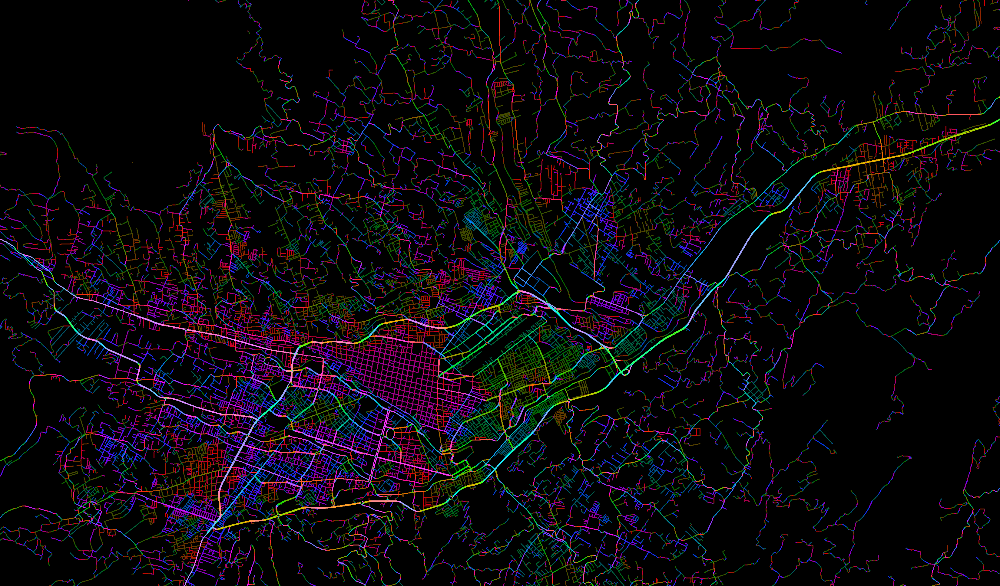
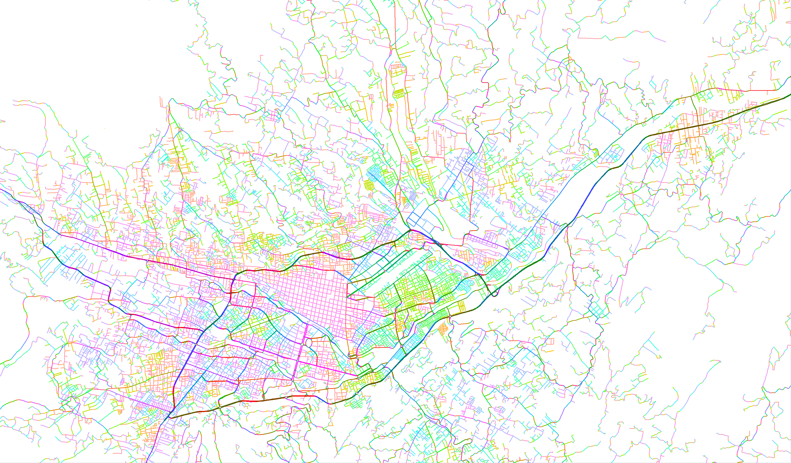
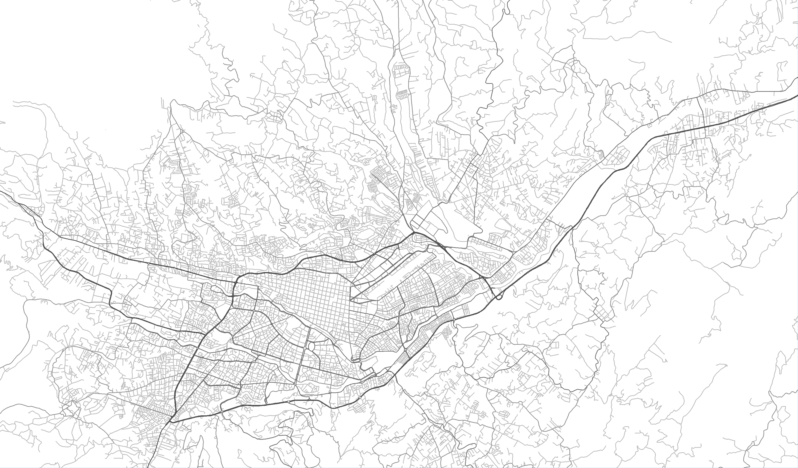

# Urban Structure Visualization Ecuador

This project uses R and OpenStreetMap data to create a visualization of the urban structure of specified areas in Ecuador. The project consists of two R scripts:

1. `UrbanStructureFunctions.R`: This script contains all the functions that are required to process the data and generate the visualizations.
2. `UrbanStructureMain.R`: This is the main script that utilizes the functions from `UrbanStructureFunctions.R` and orchestrates the overall process.

## Files

### `UrbanStructureFunctions.R`

This file includes the following functions:

- `check_and_install`: Checks if the necessary packages are installed, and installs them if they are not.
- `adjust_brightness`: Adjusts the brightness of colors for visualization.
- `plot_map`: Plots the map of the urban structure.
- `process_metro_areas`: Processes metropolitan areas' data.
- `prepare_bounding_box`: Prepares a bounding box for area of interest.
- `get_street_lines`: Retrieves street lines from OpenStreetMap.
- `get_island_water_areas`: Retrieves water and island areas from OpenStreetMap.
- `split_lines`: Splits street lines at intersections.
- `process_coordinates`: Processes coordinates of street lines for visualization.
- `save_plot_as_png`: Saves the generated plot as a PNG image.

### `UrbanStructureMain.R`

This file is the main script that should be run. It sources the functions from `UrbanStructureFunctions.R` and uses them to download, process, and visualize the urban structure data.

This script requires the following command line arguments in the specified order:

1. `city_name`: The name of the city.
2. `canton_code`: The code of the canton.
3. `pixels_per_degree`: The resolution in pixels per degree.
4. `continent_file`: The path to the continent data file (shapefile).
5. `metro_area_file`: The path to the metropolitan area data file (geopackage).
6. `functions_script_path`: The path to the `UrbanStructureFunctions.R` script file.

### Usage

You can run the `UrbanStructureMain.R` script using the following command:

``` shell
Rscript UrbanStructureMain.R "Cuenca" "0101" 17026 "map_of_ecuador/nxprovincias.shp" "map_of_ecuador/INEC_Area_Metro.gpkg" "UrbanStructureFunctions.R"
```
After running the script, a series of `.png` images will be saved to the working directory. These images visualize the urban structure of the specified area.

## Outputs

The output of this project are the PNG images that represent the urban structure of the specified area. These images show the street lines, water areas, and islands in different colors according to their characteristics.




